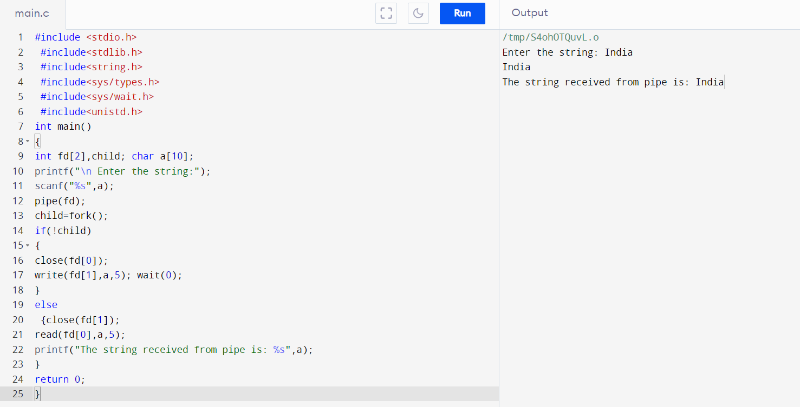

# OS-EX.6-IMPLEMENTATION-OF-INTER-PROCESS-COMMUNICATION-USING-PIPE

## AIM:
write C programs to illustrate IPC using pipes mechanisms.
## ALGORITHM:
1.Create a child process usingfork()

2.Create a simple pipe with C, we make use of the pipe() systemcall.

3.Create two file descriptor fd[0] is set up for reading, fd[1] is set up forwriting

4.Close the read end of parent process using close() and perform writeoperation.

5.Close the write end of child process and performreading

6.Display the text.

## PROGRAM:
```
#include <stdio.h>
 #include<stdlib.h>
 #include<string.h>
 #include<sys/types.h>
 #include<sys/wait.h>
 #include<unistd.h>
int main()
{
int fd[2],child; char a[10];
printf("\n Enter the string:");
scanf("%s",a);
pipe(fd);
child=fork();
if(!child)
{
close(fd[0]);
write(fd[1],a,5); wait(0);
}
else
 {close(fd[1]);
read(fd[0],a,5);
printf("The string received from pipe is: %s",a);
}
return 0;
}
```
## OUTPUT:



## RESULT:
Thus, IPC using pipes mechanisms is illustrated using c program successfully.
